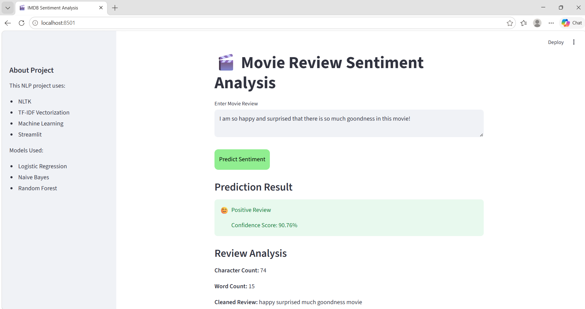
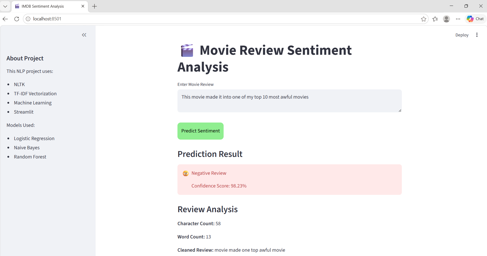

# 🎬 Movie Review Sentiment Analysis

## Project Overview

This project is an NLP-based Sentiment Analysis system built using the IMDB 50K Movie Reviews dataset.

The application predicts whether a movie review is:

- Positive 😊
- Negative 😠

A Streamlit web application is also developed for real-time prediction.

---

# Technologies Used

- Python
- Pandas
- NumPy
- NLTK
- Scikit-learn
- Matplotlib
- Seaborn
- WordCloud
- Streamlit

---

# Dataset

Dataset contains:

- 50,000 IMDB movie reviews
- Columns:
  - review
  - sentiment

Target variable:
- Positive
- Negative

---

# Project Workflow

## 1. Data Loading

Dataset loaded using Pandas.

---

## 2. Exploratory Data Analysis (EDA)

Performed:
- Sentiment distribution analysis
- Word count analysis
- Character count analysis
- Frequent word analysis
- Positive & Negative review visualization

Used:
- Matplotlib
- Seaborn

---

## 3. Text Preprocessing

Performed NLP preprocessing using NLTK:

- Lowercase conversion
- HTML tag removal
- URL removal
- Emoji removal
- Punctuation removal
- Stopword removal
- Tokenization
- Lemmatization

Purpose:
- Clean noisy text
- Improve model performance

---

# NLP Techniques Used

## Tokenization
Splits sentences into words.

## Stopword Removal
Removes common unnecessary words.

## Lemmatization
Converts words into root form.

## Bag of Words (BoW)
Converts text into numerical vectors.

## TF-IDF
Gives importance score for meaningful words.

---

# Visualizations

Created:
- Count plots
- Histograms
- Boxplots
- Word Frequency Charts
- Positive WordCloud
- Negative WordCloud
- Bigram Analysis

---

# Machine Learning Models Used

- Logistic Regression
- Naive Bayes
- Random Forest

Compared model accuracy and selected best-performing model.

---

# Evaluation Metrics

Used:
- Accuracy Score
- Confusion Matrix
- Classification Report

---

# Model Saving

Saved:
- Trained ML model
- TF-IDF Vectorizer

Using:
- Joblib

---

# Streamlit Web App

Features:
- User review input
- Real-time sentiment prediction
- Confidence percentage
- Review analysis
- Interactive UI

---
